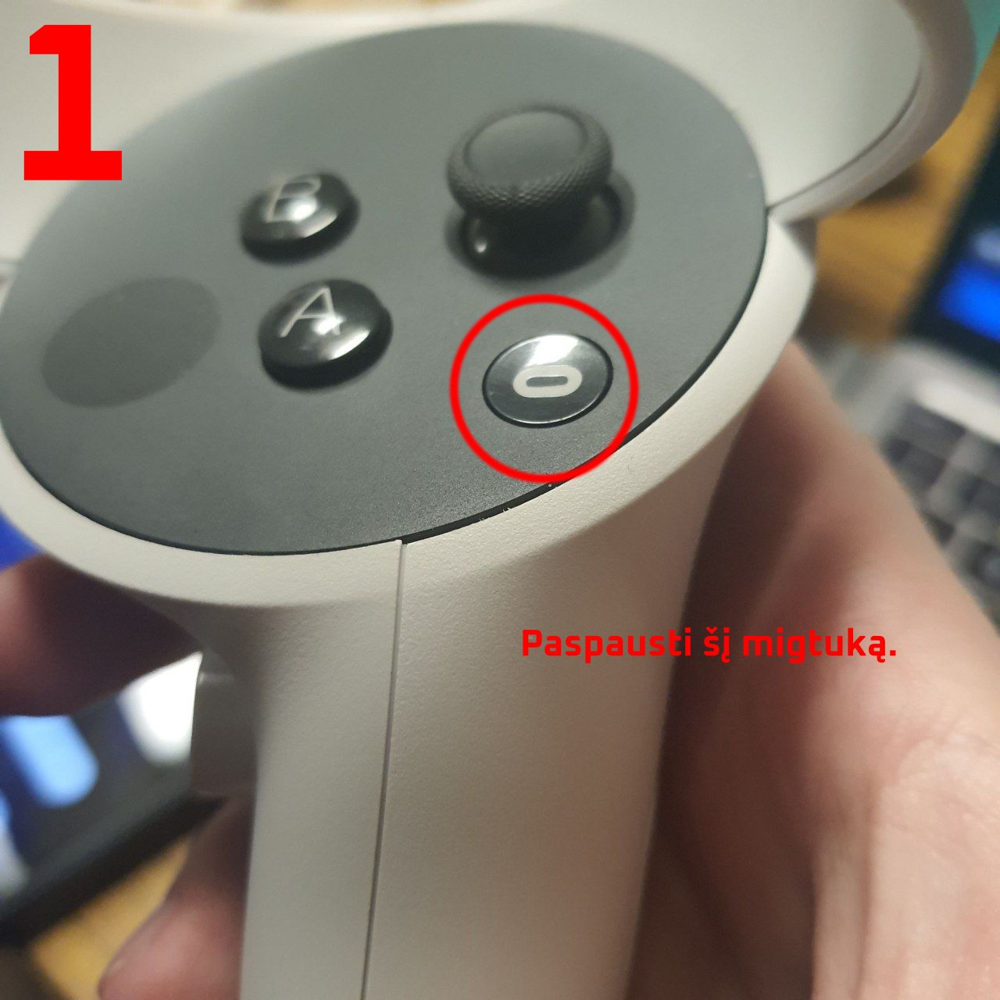
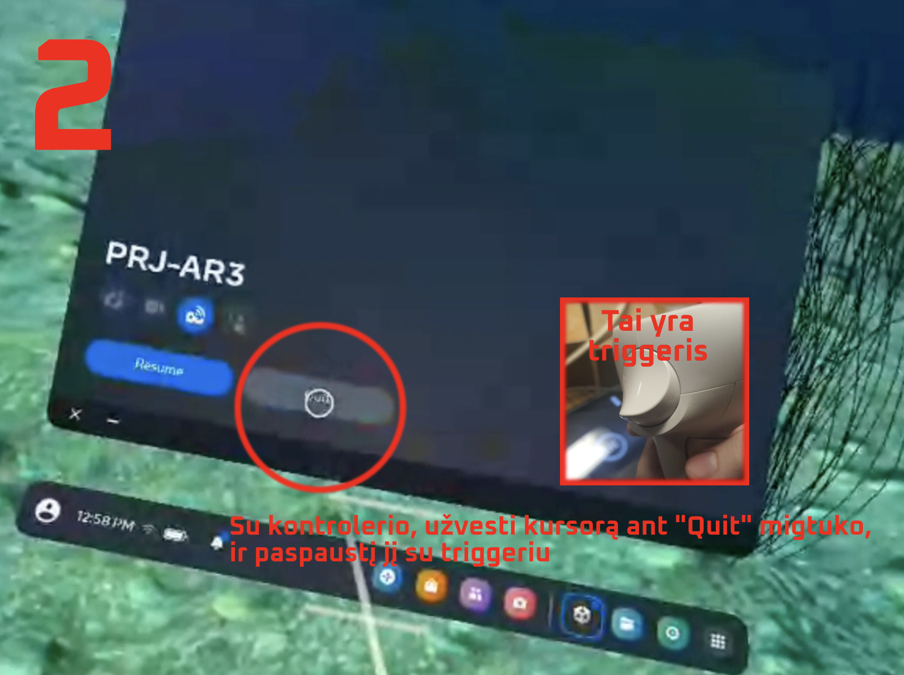
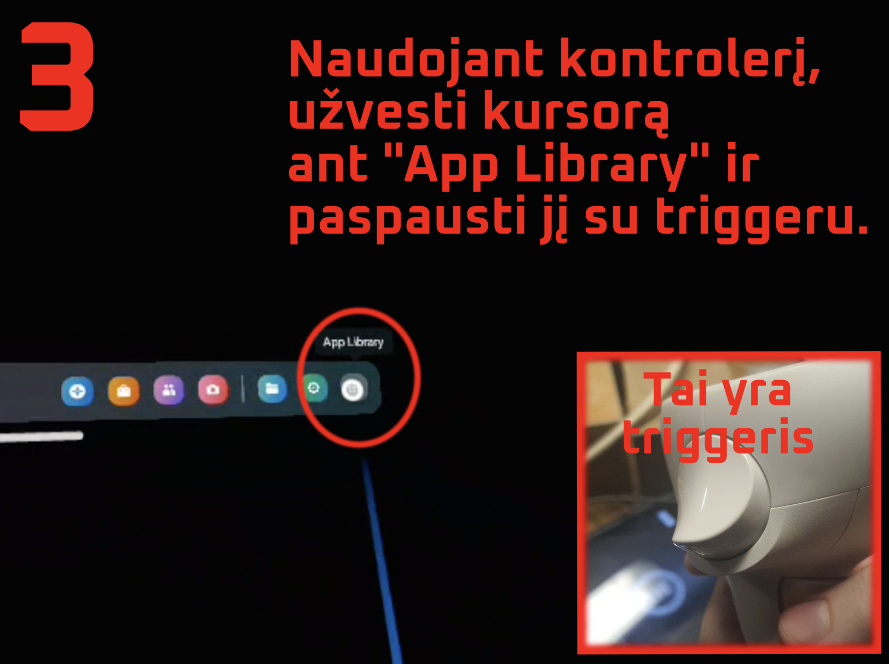
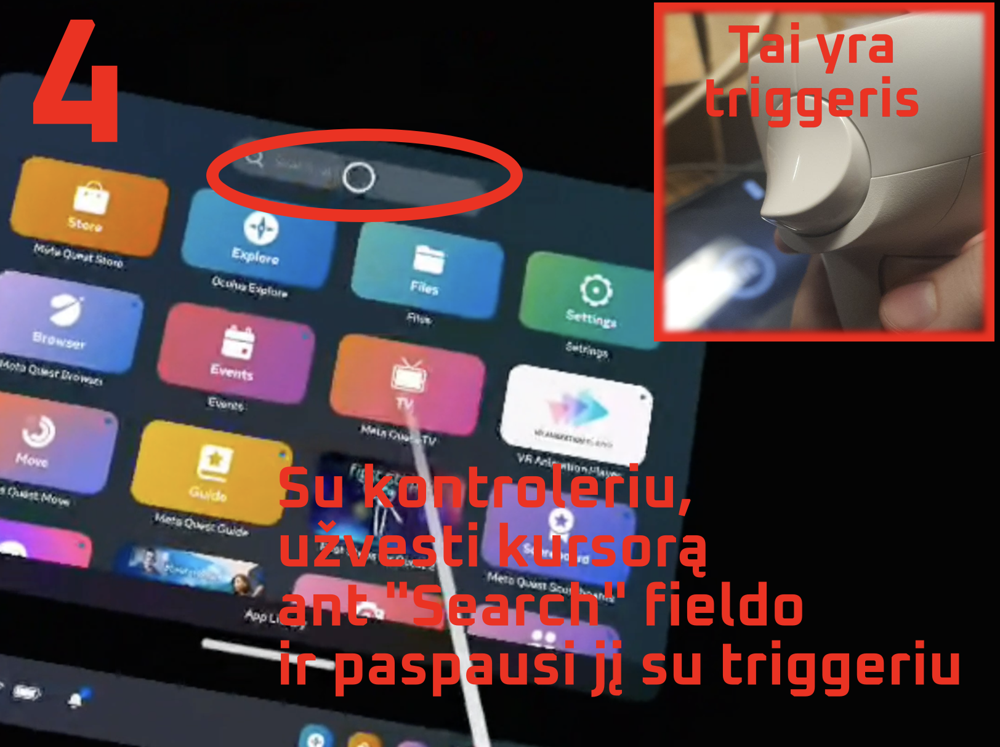
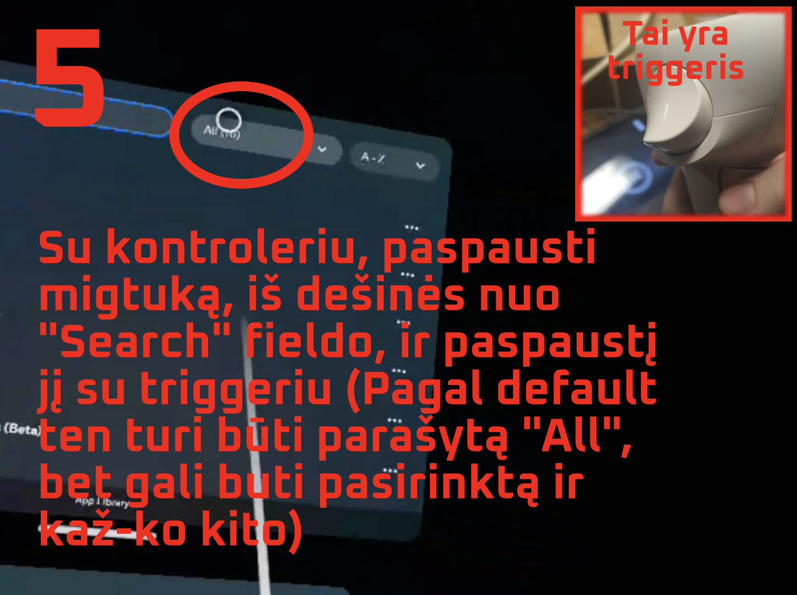
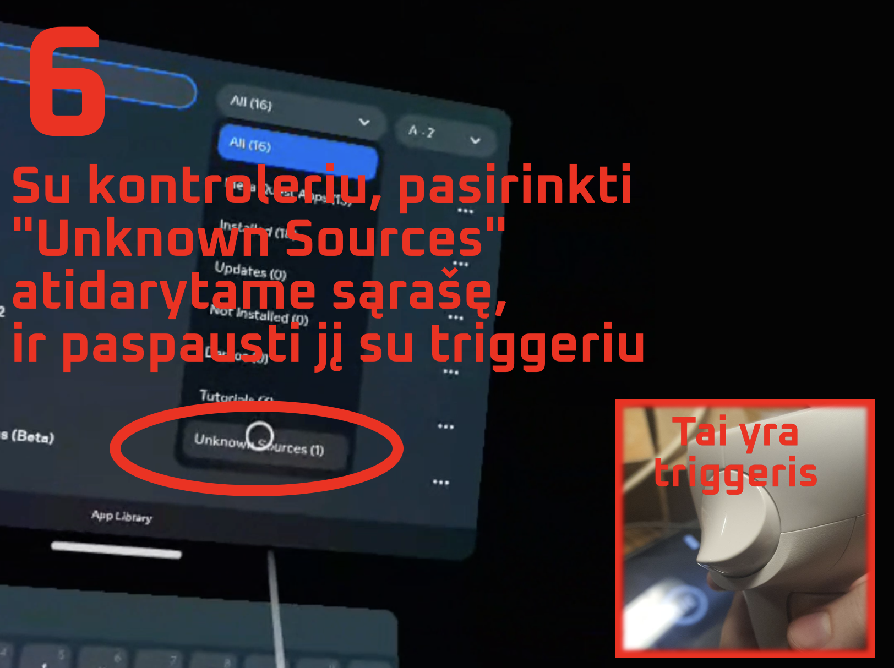
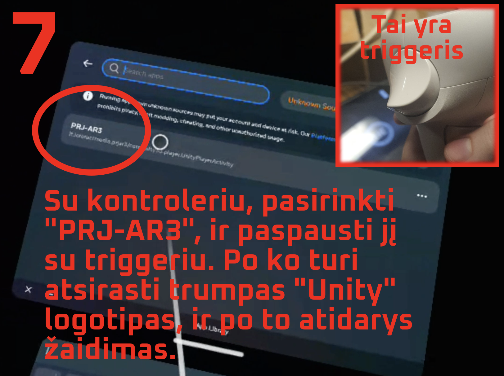

# Žaidimo Instrukciją Organizatoriams

## Serverio _(PC)_ įjungimo procedūrą

1. Įjungti TV su pulteliu _(Raudonas migtukas)_
2. Įjungti projektorį _(Migtukas prie indikatoriu)_
3. Įjungti PC _(Migtukas ant korpuso)_
4. Jeigu pasirodė juodas ekranas su užrašais, reikia paspausti F1
5. Plaukti, kol OS įsijungs.
6. Įjungti _Discord_
7. Prisijungti prie _Phone_ kanalo _M-52 "Sudūvis" Edukacinis Kambarys_ serveryje
8. Discorde įsitikintis, kad _Input Device_ nustatytas į _Microphone (4- High Definition Audio Device)_ ir _Output Device_ nustatytas į _Speakers (4- High Definition Audio Device)_. _Voice & Video_ parametruose nustatytas į _Realtek High Definition audio_
9. Prisijungtis prie _Phone_ kanalo iš laptopo (ar kokiu nors kito įrengenio, kuris bus nauduojamas su žaidejais kalbėti)

## Prieš kiekvieną žaidimą

### 1. Serverio _(PC)_ paruošimas

1. Išjungti PRJ-AR3.exe _(ALT+F4)(Jeigu jis yra įjungtas)_
2. Paleisti PRJ-AR3*XX/PRJ-AR3.exe *(Folderis ant desktopo. Vietoj XX bus numeris. Jeigu folderiu keleta, jungti reikia tą, kur numeris didesnis.)\_

### 2. RC _(Planšetės)_ paruošimas

1. Įsitikintis, kad planšetė pilnai įkrautą.
2. Pilnai išjungti PRJ-AR3. _(Reikia paspausti kairinė migtuką, ir uždaryti PRJ-AR3 su swipe aukštyn gestu) (Jeigu jis įjungtas)_
3. Įjungti PRJ-AR3 _(Yra prisiegtas prie pagrindinio ekrano. Taip yra pat Aplikacijos skyriūje)_

### 3. VR _(Šalmo)_ paruošimas

1. Įsitikintis, kad VR pilnai įkrautas.
2. Pilnai išjungti PRJ-AR3. Paspausti migtuką so ovalų ant kairinio kontrolerio, ir su triggeriu paspausti "Quit" migtuką. Jeigu žaidimas įjungtas. (žr. _"VR žaidimo perkrovimas" "Instrukcijas su paveikslais"_ skyriuje )
3. Įjungti žaidimą _(su kontroleriu atidaryti meniu (devini kvadratai ant paneles), su triggeriu paspausti "Search", kur filtrai įšsirinkti "Unknown sources", jeig neišsirinkti, ir paspausti ant PRJ-AR3, žaidimas turį įsijungti)_
4. Padėti VR į spintelė, kuriame žaidėjai turį jį rasti.

### 4. Dežučio paruošimas

1. Atsijungti dežutės nuo serverio (PC) (Jeigu įjungti) (Jungiamas į serverio priekinė USB (ilgas laidas))
2. H2 O2 dėžutė atsukti į kairę iki galo ir patikrinti ar migtukas atspaustas.
3. Patikrinti ar migtukas atspaustas ant Gęsinimo sistemos
4. Nustatyti blogą konfigūraciją minų medžiojimo dežutėje
5. Prisijungti dėžutes atgal prie serverio

## Po kiekvieno žaidimo

1. Įkrauti _(jeigu reikia)_ planšetė ir VR šalmą
2. Įšjungti aplikacijas visur _(PC, VR, Planšete)_ ir atsijungti dežutės nuo PC
3. Įšjungti PC _(numatytinai, nebūtinai)_

## Serverio _(PC)_ išjungimo procedūrą

1. Jeigu žaidimas įjungtas - išjungti _(ALT+F4)_
2. Ant desktopo paspausti **ALT+F4** ir išsirinkti "Išjungti" ("Shootdown")
3. Išjungti TV ektaną su pulteliu _(Raudonas migtukas)_
4. Išjungti projektorį _(Migtukas prie indikatorių)_

## Žaidimo kodai ir atsarginiai serverio komandos

### Scena 1: _Autentifikacija_

- Kodas: **53478169** _(įvesti į planšetė)_

### Scena 2: _Koordinatės_

- Kodas 1: **3** _(įvesti į planšetė, laukas vyršuje)_
- Kodas 2: **7** _(įvesti į planšetė, laukas žemiau kito)_

### Scena 3: _Laivo žaidimas_

- **Q** - Praleisti laivo žaidimą _(Paspausti migtuką ant klaviatūros prisijungtos prie serverio)_

### Scena 4: _Gaisras_

- **B** - Emituoti teisingą gęsinimo dėžutes reakciją _(Paspausti migtuką ant klaviatūros prisijungtos prie serverio)_
- **C** - Emituoti neteisingą gęsinimo dėžutes reakciją _(Paspausti migtuką ant klaviatūros prisijungtos prie serverio)_

### Scena 5: _Minų medžiojimo sistemą_

- **D** - Emituoti teisingą minų medžiojimo dėžutes reakciją _(Paspausti migtuką ant klaviatūros prisijungtos prie serverio (Veiks tik paskui 1 akustikos animacijos))_
- **E** - Emituoti neteisingą minų medžiojimo dėžutes reakciją _(Paspausti migtuką ant klaviatūros prisijungtos prie serverio(Veiks tik paskui 1 akustikos animacijos))_

### Scena 6: _VR Žaidimas_

- **G** - Emituoti teisingą H2 O2 dėžutes reakciją _(Paspausti migtuką ant klaviatūros prisijungtos prie serverio)_
- **F** - Emituoti neteisingą H2 O2 dėžutes reakciją _(Paspausti migtuką ant klaviatūros prisijungtos prie serverio)_
- **S** - Praleisti VR žaidimą _(Paspausti migtuką ant klaviatūros prisijungtos prie serverio)_

## Galimų problemų sprendimai

### VR žaidimas negalį prisijungti prie serverio

1. Perkrauti aplikaciją, arba šalmą _(žr. daugiau **VR Paruošimas** skyriūje)_
2. Jeigu vis neveikia, Patikrinti, ar įjungtas WI-FI ir prisijungtas prie **Xiaomi_6375** tinklo
3. Jeigu vis neveikia, Patikrinti, ar serveris (PC) ijungtas ir aplikaciją veikia
4. Jeigu vis neveikia, Perkrauti Serverį _(PC App)_ _(žr. daugiau **Serverio (PC) Paruošimas** skyriūje)_
5. Jeigu vis neveikia, Praleisti žaidimą su **S** _(žr. daugiau **Scena 6** skyriūje)_

### Planšetė negalį prisijungti prie serverio

1. Perkrauti aplikaciją. _(žr. daugiau **RC (Planšetės) Paruošimas** skyriūje)_
2. Jeigu vis neveikia, Patikrinti, ar įjungtas WI-FI ir prisijungtas prie **Xiaomi_6375** tinklo
3. Jeigu vis neveikia, Patikrinti, ar serveris _(PC)_ ijungtas ir aplikaciją veikia
4. Jeigu vis neveikia, Perkrauti Serverį _(PC App)_ _(žr. daugiau **Serverio (PC) Paruošimas** skyriūje)_

### Planšetė rodo juodą ekraną

Perkrauti aplikaciją. _(žr. daugiau **RC (Planšetės) Paruošimas** skyriūje)_

### Garsas eina ne iš TV Garsiakalbiu

1. Su įjungtu žaidimu paspausti **WIN+G**.
2. Atidaryti audio nustatymus, paspaudus migtuką su garsiakalbiu (jeigu jis ne atidarytas).
3. **MIX** tabe, **WINDOWS DEFAULT OUTPUT** parametrą nustatyti į **LG TV SSCR2 (NVIDIA High Defenition Audio)**
4. Paspausti **WIN+G**, kad uždaryti langą.

## Instrukcijas su paveikslais

### VR žaidimo perkrovimas

